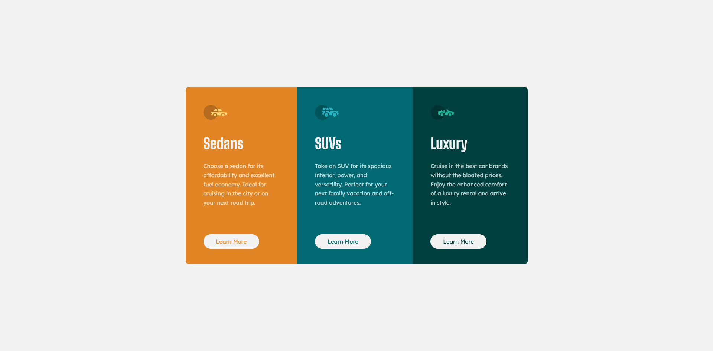

# Frontend Mentor - 3-column preview card component solution

This is a solution to the [3-column preview card component challenge on Frontend Mentor](https://www.frontendmentor.io/challenges/3column-preview-card-component-pH92eAR2-). Frontend Mentor challenges help you improve your coding skills by building realistic projects. 

## Table of contents

- [Overview](#overview)
  - [The challenge](#the-challenge)
  - [Screenshot](#screenshot)
  - [Links](#links)
- [My process](#my-process)
  - [Built with](#built-with)
  - [Continued development](#continued-development)
- [Author](#author)

## Overview

This is a sample component where you can practice the basics such as HTML and CSS. It also allows you to practice creating responsive components.

### The challenge

Users should be able to:

- View the optimal layout depending on their device's screen size
- See hover states for interactive elements

### Screenshot

### Links

- Solution URL: [https://www.frontendmentor.io/solutions/responsive-3-column-preview-card-witt-flexbox-and-media-query-tQP-IJSYoA](https://www.frontendmentor.io/solutions/responsive-3-column-preview-card-witt-flexbox-and-media-query-tQP-IJSYoA)
- Live Site URL: [https://schindlerdumagat.github.io/3-column-preview-card-component/](https://schindlerdumagat.github.io/3-column-preview-card-component/)

## My process

1. Create a Github repository for the project
2. Check the design, typography, colors, spacings and other things in the Figma file provided
3. Structure my HTML based on the design
4. Import the necessary font from the google fonts website, create a CSS reset and custom variables and style the HTML elements.
5. Polish the overall solution and check the similarities of the solution from the design provided together with its responsiveness.
6. Publish the solution in Github and create a live site.
7. Check the live site to make sure it works properly.

### Built with

- Semantic HTML5 markup
- CSS custom properties
- Flexbox
- Mobile-first workflow
- [BEM](https://getbem.com/) - Block, Element, Modifier

### Continued development

I will master the use of flexbox, grid, media queries and other responsive techniques to create a more responsive UI.

## Author

- Website - [Add your name here](https://www.your-site.com)
- Frontend Mentor - [@yourusername](https://www.frontendmentor.io/profile/yourusername)
- Twitter - [@yourusername](https://www.twitter.com/yourusername)
